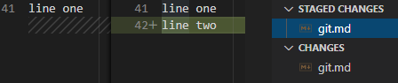
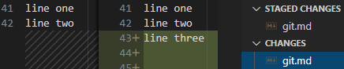
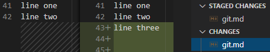

[TOC]

# Git

- ==分布式==版本控制系统，意味着每个参与者的电脑中都有一个完整的版本库

## 安装方法

- 设置用户标识
  - 全局用户标识
    ```shell
    # 当前用户的用户名
    git config --global user.name "user_name"
    # 当前用户的 Email
    git config --global user.email "user@email.com"
    ```
    - 注：表示当前机器上的所有 Git 仓库都会使用这个配置。

## 基本使用

- 将本地新分支推送到远端（在远端新建一个分支）
  ```shell
  # git push origin 本地分支:远端希望创建的分支
  git push origin local_branch:remote_branch
  ```

- 重命名已经被管理的文件
  ```shell
  # git mv old_file_name new_file_name
  git mv old.md new.md
  git mv old2.md ./sub_forder/new2.md 
  ```

## 进阶使用

- git reset
  - 初始状态
    - 
    - 
  - --soft：退回 commit 的内容到暂存区（在暂存区合并），保持工作区不变
    - 
    - 
  - --mixed：退回 commit 和 暂存区的内容到工作区（在工作区合并）
    -  
  - --hard：退回 commit、暂存区和工作区的内容（清除全部变更）
    -  
